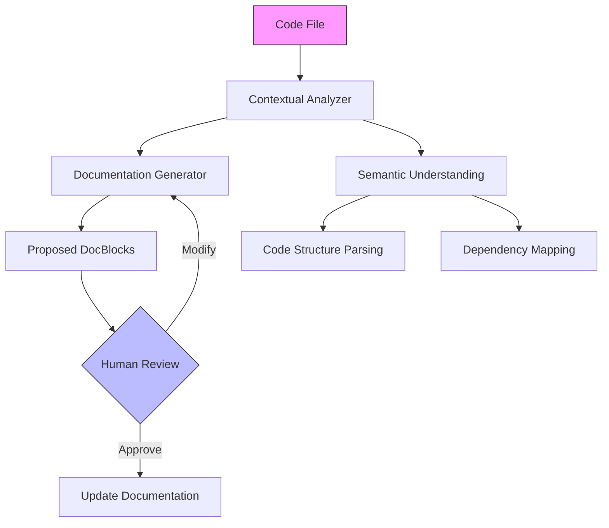

# Document File Slash Command

## Command Purpose

Analyzes PHP files to generate intelligent, contextually aware DocBlocks for files, classes, and methods that are missing documentation. The command preserves existing documentation while adding new DocBlocks where needed.

The command automatically generates professional documentation that includes:
- **File-level context** explaining the file's purpose in the system
- **Class documentation** describing responsibilities and dependencies
- **Method documentation** with parameters, return types, and exceptions
- **Preservation of existing docblocks** to avoid overwriting manual improvements

## Usage

Simply run the command with a file path:

```bash
/document-file [filepath]
```

That's it. The command automatically:
- Analyzes the target file's code structure
- Detects existing documentation to preserve manual improvements
- Generates missing DocBlocks for undocumented code
- Maintains your existing code functionality

## How It Works

The command is designed for simplicity - just provide a file path and it handles everything automatically.

**Smart Update Behavior:**
- If DocBlocks exist: Preserves existing documentation and only adds missing DocBlocks
- If no DocBlocks exist: Creates complete documentation from scratch
- Contextual awareness: Understands file's role in the larger project structure

No complex configuration required. Just run the command.

## Requirements
- PHP 7.4+
- Access to project source code
- WordPress projects supported with framework-specific intelligence

## Analysis Process

### Phase 1: Existing Documentation Check
1. Read the target file completely
2. Identify existing DocBlocks (file, class, method level)
3. Mark documented code to preserve manual improvements
4. Create list of undocumented elements

### Phase 2: Contextual Analysis
1. Analyze file's namespace and location in project
2. Identify dependencies and imported classes
3. Understand file's role in the system architecture
4. Detect if file is part of WordPress theme/plugin structure

### Phase 3: Code Structure Parsing
1. Parse PHP syntax to identify all classes and methods
2. Extract method signatures (parameters, return types)
3. Identify thrown exceptions
4. Detect method visibility (public, protected, private)

### Phase 4: Documentation Generation
1. Generate file-level DocBlock with contextual description
2. Create class DocBlocks explaining responsibilities
3. Generate method DocBlocks with parameter and return documentation
4. Add TODO markers for complex logic requiring manual review

### Phase 5: Quality Assurance
1. Verify DocBlock syntax is valid PHP
2. Ensure parameter types match method signatures
3. Validate @throws tags against actual exceptions
4. Check that descriptions are meaningful (not just repeating function names)

### Phase 6: File Update
1. Insert generated DocBlocks at appropriate locations
2. Preserve all existing code and documentation
3. Maintain original file formatting and indentation
4. Present summary of changes made

## Example Usage
```bash
# Document a single file
/document-file src/Users/UserManager.php
```

## Documentation Principles

### File DocBlock
```php
/**
 * [Brief, clear description of file's purpose]
 *
 * Detailed explanation of the file's role in the system.
 * Highlights key responsibilities and interactions.
 *
 * @package App\[Namespace]
 * @subpackage [Optional context]
 * @category [Functional classification]
 */
```

### Class DocBlock
```php
/**
 * [Clear description of class purpose]
 *
 * Explains the class's responsibilities, 
 * key methods, and system integration.
 *
 * @responsible [Primary system responsibility]
 * @dependencies [Key external dependencies]
 */
```

### Method DocBlock
```php
/**
 * [Clear, concise method description]
 *
 * Explains method's purpose, behavior, and significance.
 *
 * @param Type $paramName Description of parameter
 * @return Type Description of return value
 *
 * @throws ExceptionType Conditions causing exception
 *
 * @example Brief usage example
 */
```

### What NOT to Document
When generating documentation, exclude:
- **Framework/CMS Functions**: Do not document WordPress core functions (e.g., `esc_attr`, `esc_html`, `wp_enqueue_script`, `get_option`)
- **Standard Library Functions**: Skip native PHP functions (e.g., `array_map`, `json_encode`)
- **Common Utility Functions**: Omit well-known third-party library functions
- **Focus**: Document only custom business logic, application-specific methods, and domain-specific implementations

## Manual Review Markers

The command adds TODO comments within DocBlocks for items requiring human review:

```php
/**
 * Processes user payment transactions
 *
 * <!-- TODO: Document edge cases for failed transactions -->
 * <!-- TODO: Verify exception types thrown -->
 *
 * @param array $payment_data Payment information
 * @return bool Success status
 */
```

These markers help identify areas where:
- Complex business logic needs detailed explanation
- Exception handling should be verified
- Edge cases or security considerations should be documented
- Integration details require domain expertise

## Architectural Context Diagram


## Limitations & Considerations
- Cannot generate 100% accurate documentation
- Requires human verification
- Best used as documentation starting point

## Error Handling
- Graceful handling of complex code structures
- Clear error messages for unprocessable files
- Option to skip problematic sections

## Future Enhancements
- Support for additional programming languages
- Machine learning documentation improvements
- Integration with static analysis tools

## Best Practices
1. Always review generated documentation
2. Manually refine technical details
3. Ensure documentation matches implementation
4. Keep documentation concise and meaningful
5. Do not document native WordPress or framework functions (e.g., `esc_attr`, `esc_html`, `wp_enqueue_script`)
6. Focus documentation on custom business logic and application-specific functionality

## Implementation Notes

### For Cursor AI
When executing this command:

1. **Read target file completely** to understand structure and existing documentation
2. **Identify undocumented elements** (file, classes, methods) that need DocBlocks
3. **Analyze project context** by reading related files to understand purpose
4. **Detect WordPress context** if applicable to use framework-specific knowledge
5. **Generate DocBlocks** following the templates provided in this command
6. **Preserve existing documentation** - never overwrite manual improvements
7. **Skip framework functions** - do not document calls to WordPress/PHP core functions
8. **Add TODO markers** for complex logic requiring manual review
9. **Validate syntax** to ensure generated DocBlocks are valid PHP
10. **Present changes** showing what was added with clear summary

### Quality Guidelines
- Method descriptions should explain WHY not just WHAT
- Parameter descriptions should clarify purpose and expected format
- Return descriptions should explain what the value represents
- Only add @throws if exceptions are actually thrown in the code
- Avoid redundant descriptions like "Returns the return value"

## Example Command Execution

```
You: /document-file src/Services/PaymentProcessor.php

AI: I'll analyze the file and generate missing DocBlocks while preserving existing documentation.

[Reading file...]

Found: PaymentProcessor class with 8 methods
Existing documentation: 2 methods already documented
Undocumented: 1 file docblock, 1 class docblock, 6 method docblocks

Generating documentation...

✓ Added file-level DocBlock
✓ Added class DocBlock for PaymentProcessor
✓ Added method DocBlock for process_payment()
✓ Added method DocBlock for validate_card()
✓ Added method DocBlock for charge_customer()
✓ Added method DocBlock for handle_refund()
✓ Added method DocBlock for log_transaction()
✓ Added method DocBlock for send_receipt()

Documentation added: 8 new DocBlocks
Manual review items: 3 TODO markers added
Existing documentation: Preserved 2 existing method DocBlocks

Next steps:
1. Review TODO markers for complex logic
2. Verify exception types are correct
3. Add any missing edge case documentation
4. Commit the documented file

Documentation complete! File ready for review.
```

## Success Criteria

Documentation is considered complete when:

- ✅ File has top-level DocBlock explaining its purpose
- ✅ All classes have DocBlocks describing responsibilities
- ✅ All public methods have complete DocBlocks
- ✅ All parameters are documented with types and descriptions
- ✅ Return values are documented with types and descriptions
- ✅ Thrown exceptions are documented with @throws tags
- ✅ Existing documentation is preserved unchanged
- ✅ No WordPress/PHP core functions are documented
- ✅ DocBlock syntax is valid and properly formatted
- ✅ Descriptions are meaningful (not just repeating names)
- ✅ TODO markers added for items needing manual review
- ✅ Original code functionality is unchanged

## Performance Considerations
- Minimal runtime overhead
- Single-file processing for focused documentation
- No external dependencies required

## Privacy and Security
- **Never expose sensitive data** in DocBlocks (API keys, passwords, credentials)
- **Sanitize examples** - use placeholder values for sensitive information
- **Preserve security** - no code modification, documentation only
- **Respect access controls** - maintain original file permissions

## Troubleshooting
- Verify PHP syntax in target file is valid
- Check file permissions for read/write access
- Ensure file is a valid PHP file (.php extension)
- Validate that existing DocBlocks use proper syntax

---

**Command Version**: 2.0.0  
**Last Updated**: 2025-10-27  
**Compatible With**: Cursor AI Editor

## Changelog

### Version 2.0.0 (2025-10-27)
- **Breaking Changes**: Removed `@since` and `@see` tags to reduce over-documentation
- Added smart update behavior to preserve existing documentation
- Enhanced phase-based analysis process (6 phases)
- Added explicit WordPress function exclusion guidance
- Added Implementation Notes for Cursor AI execution
- Added Example Command Execution showing workflow
- Added Success Criteria checklist
- Enhanced Privacy and Security section
- Added Manual Review Markers section
- Improved Quality Guidelines for documentation

### Version 1.0.0 (2025-10-26)
- Initial release with basic DocBlock generation
- Support for file, class, and method documentation
- WordPress-aware documentation capabilities