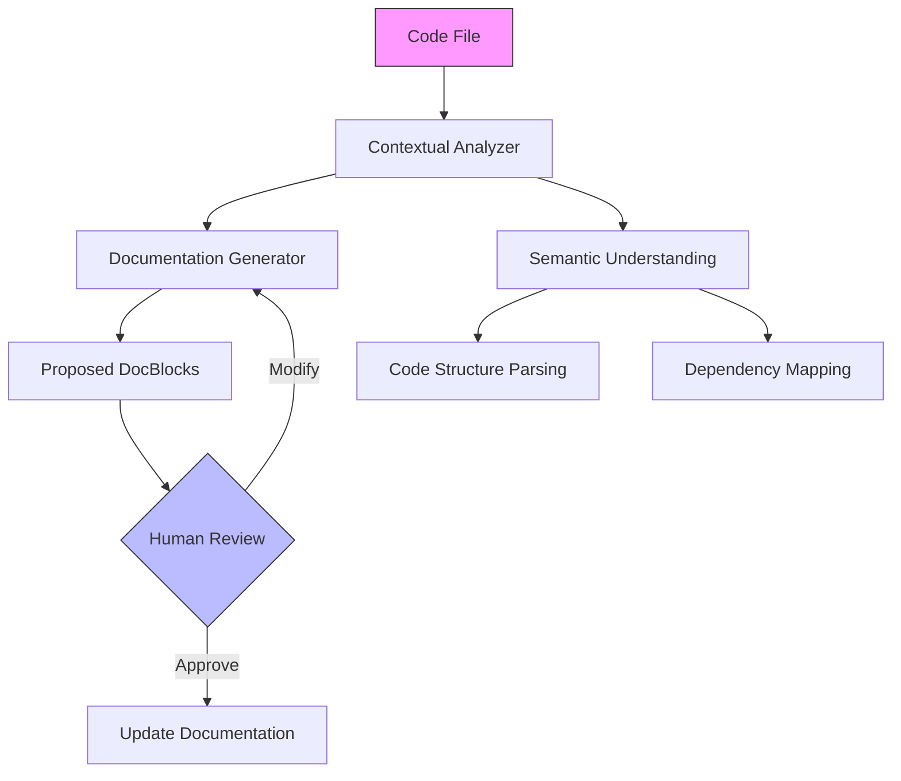

# Document File Slash Command

## Overview
A comprehensive tool for generating intelligent, contextually aware PHP DocBlocks for files, classes, and methods.

## Command Syntax
```bash
/document-file [filepath] [options]
```

## Requirements
- PHP 7.4+
- Composer installed
- Access to project source code

## Detailed Workflow

### 1. File-Level Analysis
- Scan entire project structure
- Identify file's role and relationships
- Extract contextual information

### 2. Documentation Generation Process
- Analyze code structure
- Identify classes and methods
- Generate hierarchical documentation
- Preserve existing code functionality

## Options
```bash
--verbose         # Provide detailed documentation insights
--dry-run         # Preview documentation without writing
--style=[formal|casual]  # Documentation tone
--depth=[file|class|method]  # Documentation granularity
```

## Example Usage
```bash
# Document a single file
/document-file src/Users/UserManager.php

# Document with verbose output
/document-file src/Users/UserManager.php --verbose

# Preview documentation
/document-file src/Users/UserManager.php --dry-run
```

## Documentation Principles

### File DocBlock
```php
/**
 * [Brief, clear description of file's purpose]
 *
 * Detailed explanation of the file's role in the system.
 * Highlights key responsibilities and interactions.
 *
 * @package App\[Namespace]
 * @subpackage [Optional context]
 * @category [Functional classification]
 *
 * @see [Related components]
 * @since [Version introduced]
 */
```

### Class DocBlock
```php
/**
 * [Clear description of class purpose]
 *
 * Explains the class's responsibilities, 
 * key methods, and system integration.
 *
 * @responsible [Primary system responsibility]
 * @dependencies [Key external dependencies]
 */
```

### Method DocBlock
```php
/**
 * [Clear, concise method description]
 *
 * Explains method's purpose, behavior, and significance.
 *
 * @param Type $paramName Description of parameter
 * @return Type Description of return value
 *
 * @throws ExceptionType Conditions causing exception
 *
 * @example Brief usage example
 */
```

## Architectural Context Diagram


## Limitations & Considerations
- Cannot generate 100% accurate documentation
- Requires human verification
- Best used as documentation starting point

## Error Handling
- Graceful handling of complex code structures
- Clear error messages for unprocessable files
- Option to skip problematic sections

## Future Enhancements
- Support for additional programming languages
- Machine learning documentation improvements
- Integration with static analysis tools

## Best Practices
1. Always review generated documentation
2. Manually refine technical details
3. Ensure documentation matches implementation
4. Keep documentation concise and meaningful

## Performance Considerations
- Minimal runtime overhead
- Configurable depth of analysis
- Caching of parsed information

## Security
- No code modification
- Read-only access to source files
- Configurable access controls

## Troubleshooting
- Verify PHP and Composer installation
- Check file permissions
- Validate project structure compatibility

## Contribution
Contributions welcome! 
- Report issues on GitHub
- Submit pull requests
- Follow project contribution guidelines