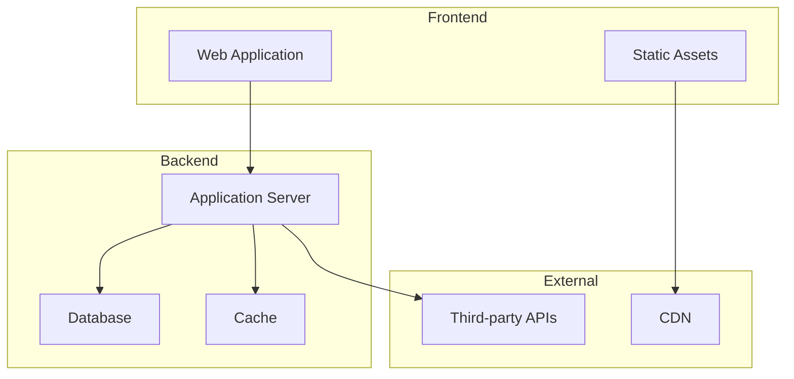
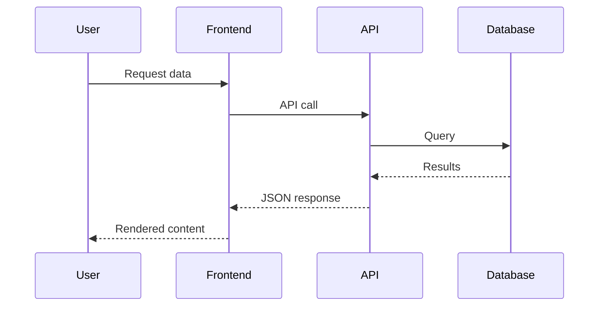
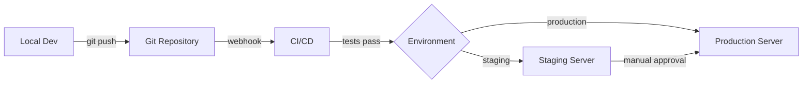

# Document Project Slash Command

## Command Purpose

Analyzes an entire codebase to generate a streamlined `/docs` directory with consolidated markdown documentation covering architecture, setup, workflows, and technical implementation details.

The command automatically generates concise documentation that includes:
- **Architecture diagrams** using Mermaid for visual clarity
- **Code examples** from your actual codebase
- **Consolidated files** instead of fragmented subdirectories
- **Cursor-optimized content** designed for AI context inclusion

The documentation prioritizes brevity and clarity, making it perfect for:
- **Onboarding new developers** with quick-start information
- **Reference documentation** for existing team members
- **Cursor AI context** to enhance AI-assisted development

## Usage

Simply run the command in any project:

```
/document-project
```

That's it. The command automatically:
- Detects your project type (WordPress, API, or generic)
- Scans your entire codebase
- Checks for existing `/docs` directory and uses it as context if present
- Generates complete documentation with diagrams, examples, and API docs
- Preserves any manual improvements from previous documentation

## How It Works

The command is designed for simplicity - just run `/document-project` and it handles everything automatically.

**Smart Update Behavior:**
- If `/docs` directory exists: Uses existing docs as context and regenerates fresh documentation, preserving your manual edits and improvements
- If `/docs` doesn't exist: Creates complete documentation from scratch

**Flat Structure Philosophy:**
The command generates all documentation files directly in the `/docs` directory (no subdirectories). This makes it easier to:
- Link documentation in Cursor rules/context
- Navigate and find information quickly
- Maintain documentation over time
- Reduce file fragmentation

No flags, no configuration required. Just run the command.

## Documentation Structure

The command generates a simplified, flat structure in `/docs`:

```
docs/
├── README.md                    # Main entry point with navigation
├── project-overview.md          # Project context, team info, and goals
├── development-workflow.md      # Setup, branching, standards, testing, build process
├── environments.md              # All environments (local, staging, production)
├── architecture.md              # System design, tech stack, directory structure, data models
├── features.md                  # Core functionality and features (or separate files for major features)
├── integrations.md              # All third-party integrations and APIs
├── operations.md                # Database, caching, backup, troubleshooting
└── api.md                       # API documentation (only if APIs detected)
```

**WordPress-specific additions (when detected):**
```
docs/
├── content-types.md             # Custom post types, taxonomies, custom fields
├── block-editor.md              # Custom blocks, patterns, and modifications
└── themes.md                    # Theme structure and customization
```

## Analysis Process

### Phase 1: Documentation Context Check
1. Check if `/docs` directory exists
2. If exists, read all existing documentation
3. Identify manual improvements and custom content
4. Use existing docs as a guide for structure and tone

### Phase 2: Codebase Discovery
1. Scan root directory for project indicators
2. Automatically identify project type (WordPress, API, generic)
3. Detect package managers and build tools
4. Map directory structure and conventions
5. Identify key configuration files

### Phase 3: Context Gathering
1. Read README, package.json, composer.json
2. Parse configuration files for environment details
3. Analyze Git history for project timeline
4. Detect installed dependencies and versions
5. Identify team members from commits (if requested)

### Phase 4: Code Analysis
1. Map application entry points
2. Identify core features and functionality
3. Document public APIs and interfaces
4. List third-party integrations
5. Detect authentication and security patterns

### Phase 5: Documentation Generation
1. Create README.md with navigation structure
2. Generate project-overview.md with context
3. Create development-workflow.md combining setup, branching, standards, testing, and build processes
4. Build environments.md with all environment information
5. Create architecture.md combining system design, tech stack, and data models with diagrams
6. Document features.md with core functionality (or separate files for major features only)
7. Generate integrations.md consolidating all third-party services
8. Create operations.md with database, caching, backup, and troubleshooting
9. Generate api.md (only if APIs detected)
10. Add WordPress-specific files if detected (content-types.md, block-editor.md, themes.md)

### Phase 6: Quality Assurance
1. Verify all internal links work
2. Ensure consistent formatting
3. Validate code examples
4. Check for completeness
5. Add TODO markers for manual review items

## Documentation Standards

### README.md Structure
```markdown
# [Project Name] Documentation

[Brief project description]

## Getting Started

Links to essential getting started docs

## Documentation Sections

Organized navigation with descriptions

## Quick Links

- Development tools
- Environments
- External resources

## Contributing

Link to contribution guidelines
```

### Individual Document Structure
```markdown
# [Topic Name]

Brief introduction to the topic

## Overview

High-level explanation

## [Main Sections]

Detailed content with examples

## Related Documentation

Links to related docs

## Additional Resources

External links and references
```

### Documentation Style

The command automatically adapts its writing style to be:
- **Concise and Scannable**: Written for quick reference and Cursor context inclusion
- **Technically Accurate**: Includes specific implementation details without fluff
- **Practical**: Focuses on how to use and maintain the system
- **Well-Organized**: Uses clear headers and bullet points for easy navigation

The documentation prioritizes brevity and clarity, making it suitable for both onboarding new developers and serving as context for AI-assisted development in Cursor.

## Content Guidelines

### project-overview.md
- Client/stakeholder information
- Project goals and problems it solves
- Team structure (optional)
- Timeline and major milestones
- High-level tech stack summary

### development-workflow.md
- Prerequisites and required software versions
- Local environment setup steps
- Branch management strategy (e.g., trunk-based, GitFlow)
- Code standards and conventions
- Testing approach
- Build and deployment process

### environments.md
- Local development environment details
- Staging environment information and URLs
- Production environment information and URLs
- Environment-specific configuration differences
- Access credentials location (without exposing them)

### architecture.md
- System architecture diagram (Mermaid)
- Key components and their relationships
- Technology stack with versions
- Directory structure overview
- Database schema and data models
- Security and authentication approach
- Performance and caching strategies

### features.md
- Core features overview
- For each major feature: purpose, implementation, and configuration
- User flows for key functionality
- Important edge cases and limitations

**Note:** For projects with many complex features, you may create separate feature files (e.g., `user-management.md`, `payment-processing.md`) instead of consolidating everything into features.md. Use judgment - if a single feature would make features.md extremely long (>500 lines), split it out.

### integrations.md
- List of all third-party services
- For each integration: purpose, authentication, configuration, and code examples
- Webhook handlers if applicable
- Troubleshooting common integration issues

### operations.md
- Database management (backup, restore, sync between environments)
- Cache management strategies
- Common troubleshooting steps
- Monitoring and logging approach
- Performance optimization tips

### api.md (only if APIs detected)
- API architecture overview
- Authentication methods
- Available endpoints with examples
- Webhook documentation
- Rate limiting and error handling

## Example Output: README.md

```markdown
# MyProject Documentation

Welcome to MyProject documentation. This WordPress multisite platform with custom themes and integrations serves multiple international markets.

## Getting Started

Start here to understand the project context and setup:

- **[Project Overview](project-overview.md)** - Team structure, client information, and project context
- **[Development Workflow](development-workflow.md)** - Branch management, deployment process, and development guidelines
- **[Environments](environments.md)** - Production, staging, and local environment information

## Technical Documentation

### Core System
- **[Architecture](architecture.md)** - System design, tech stack, directory structure, and data models
- **[Features](features.md)** - Core functionality and features
- **[API](api.md)** - API endpoints, authentication, and integration guide

### WordPress-Specific (if detected)
- **[Content Types](content-types.md)** - Post types, taxonomies, and custom fields
- **[Block Editor](block-editor.md)** - Custom blocks, patterns, and core block modifications
- **[Themes](themes.md)** - Theme structure and customization approach

### Integrations & Operations
- **[Third-Party Integrations](integrations.md)** - Formstack, Analytics, and other external services
- **[Operations](operations.md)** - Database sync, caching, backup procedures, and troubleshooting

## Quick Links

### Development
- [Repository](https://github.com/org/project)
- [Issue Tracker](https://github.com/org/project/issues)
- [CI/CD Pipeline](https://ci.example.com/project)

### Environments
- **Production**: [www.example.com](https://www.example.com)
- **Staging**: [staging.example.com](https://staging.example.com)
- **Local**: [myproject.local](http://myproject.local)
```

## Intelligent Content Detection

The command automatically detects and documents:

### Automatic Project Type Detection

The command intelligently identifies your project type by analyzing:
- **WordPress Projects**: Detects `wp-config.php`, `wp-content/`, WordPress theme/plugin structures
- **API Projects**: Detects API routes, endpoint definitions, OpenAPI specs
- **Generic Projects**: Falls back to language-agnostic documentation for any other project type

Based on detection, it automatically generates appropriate framework-specific documentation without requiring configuration.

### Configuration Files
- `package.json`, `composer.json` - Dependencies and scripts
- `.env.example` - Environment variables
- `webpack.config.js`, `vite.config.js` - Build configuration
- `phpunit.xml`, `jest.config.js` - Testing setup
- `docker-compose.yml` - Container setup

### WordPress-Specific
- Custom post types and taxonomies
- Custom blocks and patterns
- Theme customization hooks
- Multisite configuration
- Plugin dependencies
- WP-CLI commands

### APIs and Integrations
- REST endpoints
- GraphQL schemas
- Webhook handlers
- Third-party API integrations
- Authentication methods

## Diagram Generation

Mermaid diagrams are automatically included in the documentation to provide visual representations of architecture and workflows:

### System Architecture Diagram


### Data Flow Diagram


### Deployment Flow Diagram


## Smart Documentation Updates

When the command detects an existing `/docs` directory, it intelligently:

1. **Reads existing documentation** to understand your project's documentation style and custom content
2. **Preserves manual improvements** like custom sections, additional notes, or refined explanations
3. **Updates with current codebase** to reflect any code changes since last generation
4. **Maintains consistency** by following the structure and tone of existing docs
5. **Consolidates content** while preserving important details from existing files

This means you can:
- Run the command multiple times as your project evolves
- Make manual edits to documentation without losing them
- Keep docs in sync with codebase changes automatically
- Refine documentation over time with each generation improving on the last

**Important:** If your existing docs use subdirectories (from an older version of this command), the new generation will consolidate them into the flat structure while preserving all content.

**To keep documentation current:** Simply run `/document-project` whenever you want to update your docs. The command handles everything automatically.

## Manual Review Markers

The command adds TODO markers for items requiring human review:

```markdown
<!-- TODO: Add team member contact information -->
<!-- TODO: Verify production URL is correct -->
<!-- TODO: Add screenshots for this feature -->
<!-- TODO: Review and update deployment checklist -->
```

## Best Practices Applied

1. **Flat Structure**: All files in `/docs` root for easy access and linking
2. **Consolidated Content**: Related topics combined into single files to reduce fragmentation
3. **Concise and Scannable**: Optimized for quick reference and AI context inclusion
4. **Clear Navigation**: README provides clear entry points to all documentation
5. **Code Examples**: Real examples from your codebase where relevant
6. **Visual Diagrams**: Mermaid diagrams for complex concepts (architecture, data flow)
7. **Link Validation**: All internal links are verified
8. **Context-Ready**: Written for both human readers and Cursor AI context
9. **Minimal Redundancy**: Information appears once in the most logical location
10. **TODO Markers**: Clear indicators for sections requiring manual review

## Implementation Notes

### For Cursor AI
When executing this command:

1. Check for existing `/docs` directory first
2. If exists, read and analyze all existing documentation to preserve manual improvements
3. Request workspace access to read all project files
4. Parse project configuration files (package.json, composer.json, etc.)
5. Build mental model of project structure and features
6. Generate consolidated documentation in flat structure:
   - Combine related topics into single files (e.g., all development info in development-workflow.md)
   - Keep content concise and scannable for Cursor context
   - Use bullet points and clear headers instead of lengthy prose
7. Include Mermaid diagrams for architecture visualization
8. Add only WordPress-specific files if WordPress is detected
9. Validate all generated links
10. Present summary of generated documentation
11. Highlight sections needing manual review with TODO markers

### Performance Considerations
- For large codebases (>10,000 files), focus on key directories
- Skip `node_modules`, `vendor`, `.git` directories
- Process files in batches to avoid timeouts
- Cache analysis results for regeneration

### Privacy and Security
- Never include sensitive data (API keys, passwords)
- Sanitize any configuration examples
- Mark sensitive sections clearly
- Respect `.gitignore` patterns
- Allow exclusion patterns via config

## Example Command Execution

```
You: /document-project

AI: I'll analyze your codebase and generate comprehensive documentation with diagrams, examples, and API docs.

[Scans project files...]

Detected: WordPress multisite project with custom themes
Languages: PHP, JavaScript, CSS
Package managers: Composer, npm
Build tools: Webpack

Generating documentation...

✓ Created /docs/README.md
✓ Created /docs/project-overview.md
✓ Created /docs/development-workflow.md
✓ Created /docs/environments.md
✓ Created /docs/architecture.md
✓ Created /docs/features.md
✓ Created /docs/integrations.md
✓ Created /docs/operations.md
✓ Created /docs/content-types.md
✓ Created /docs/block-editor.md
✓ Created /docs/themes.md

Documentation generated: 11 markdown files
Diagrams included: 5 Mermaid diagrams
Code examples: 15+ examples from your codebase
Manual review items: 6

Next steps:
1. Review /docs/README.md for navigation
2. Check TODO markers for manual updates
3. Verify environment URLs are correct
4. Add team member information if needed

Documentation is ready! Start with /docs/README.md
```

## Success Criteria

Documentation is considered complete when:

- ✅ All documentation files in flat `/docs` structure
- ✅ All major features are documented concisely
- ✅ Setup process is clear in development-workflow.md
- ✅ Architecture is explained with diagrams in architecture.md
- ✅ All integrations consolidated in integrations.md
- ✅ Environment information complete in environments.md
- ✅ Operations and troubleshooting in operations.md
- ✅ All internal links work correctly
- ✅ Code examples are accurate and from actual codebase
- ✅ Content is concise and scannable for Cursor context
- ✅ No sensitive information is exposed
- ✅ Manual review items marked with TODO comments

---

## ✨ Standalone Command

**This is a standalone utility command.**

`/document-project` is not part of the main workflow sequence. Use it anytime you need to generate or update comprehensive project documentation.

**Common usage scenarios:**
- When starting a new project to establish documentation foundation
- After major architectural changes or refactoring
- When onboarding new team members who need project context
- Periodically (monthly/quarterly) to keep documentation current with codebase
- Before major releases to ensure documentation is up-to-date

**Related documentation command:**
- Use `/document-file` to generate DocBlocks for individual PHP files

**Tip:** Run this command regularly (e.g., monthly) to keep your `/docs` directory synchronized with codebase changes. The smart update behavior preserves your manual improvements while refreshing technical details.

---

**Command Version**: 2.0.0  
**Last Updated**: 2025-10-27  
**Compatible With**: Cursor AI Editor

## Changelog

### Version 2.0.0 (2025-10-27)
- **Breaking Change**: Simplified to flat directory structure (no subdirectories)
- Consolidated related documentation into single files
- Reduced typical output from 40+ files to 8-12 files
- Optimized content for Cursor AI context inclusion
- Enhanced focus on concise, scannable documentation
- Updated to follow Velcro project documentation pattern

### Version 1.0.0 (2025-10-26)
- Initial release with nested directory structure