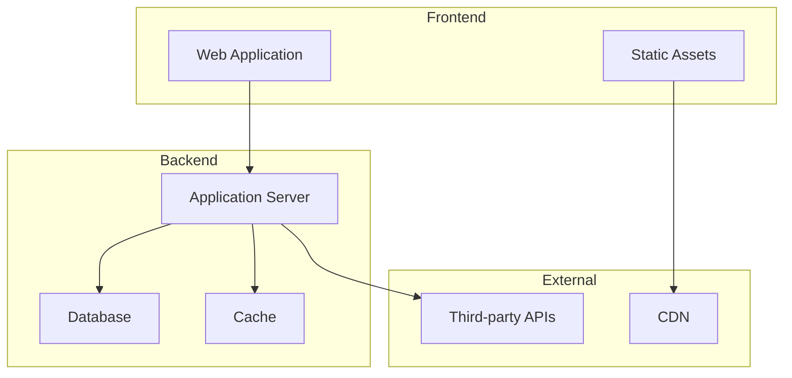
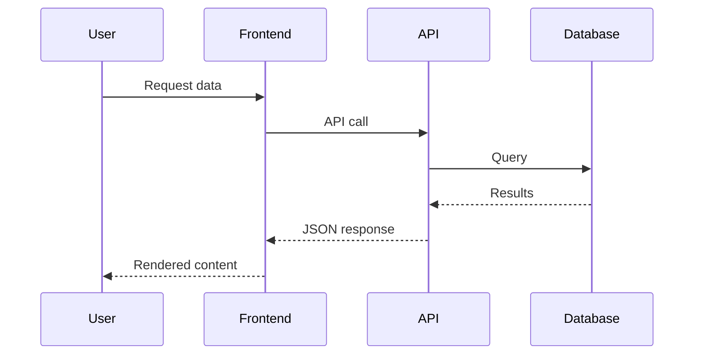
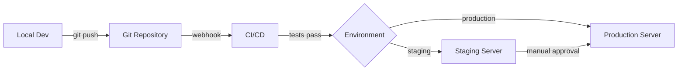

# Document Project Slash Command

## Command Purpose

Analyzes an entire codebase to generate a complete `/docs` directory with structured markdown documentation covering architecture, setup, workflows, and technical implementation details.

The command automatically generates comprehensive documentation that includes:
- **Architecture diagrams** using Mermaid for visual clarity
- **Code examples** from your actual codebase
- **API documentation** when API endpoints are detected
- **All standard sections** for complete project coverage

The documentation balances technical depth with accessibility, making it suitable for both onboarding and reference purposes.

## Usage

Simply run the command in any project:

```
/document-project
```

That's it. The command automatically:
- Detects your project type (WordPress, API, or generic)
- Scans your entire codebase
- Checks for existing `/docs` directory and uses it as context if present
- Generates complete documentation with diagrams, examples, and API docs
- Preserves any manual improvements from previous documentation

## How It Works

The command is designed for simplicity - just run `/document-project` and it handles everything automatically.

**Smart Update Behavior:**
- If `/docs` directory exists: Uses existing docs as context and regenerates fresh documentation, preserving your manual edits and improvements
- If `/docs` doesn't exist: Creates complete documentation from scratch

No flags, no configuration required. Just run the command.

## Documentation Structure

The command generates the following directory structure in `/docs`:

```
docs/
├── README.md                           # Main entry point with navigation
├── project-overview.md                 # Project context and team info
├── getting-started.md                  # Quick start guide
├── architecture/
│   ├── overview.md                     # System architecture
│   ├── technology-stack.md             # Technologies and versions
│   ├── directory-structure.md          # Codebase organization
│   ├── data-models.md                  # Database schema and models
│   └── dependencies.md                 # Third-party dependencies
├── development/
│   ├── setup.md                        # Local environment setup
│   ├── workflow.md                     # Development process
│   ├── branching-strategy.md           # Git workflow
│   ├── code-standards.md               # Coding conventions
│   ├── testing.md                      # Testing approach
│   └── build-process.md                # Build and deployment
├── features/
│   ├── feature-index.md                # All features overview
│   ├── [feature-name].md               # Individual feature docs
│   └── ...
├── integrations/
│   ├── integration-index.md            # All integrations overview
│   ├── [integration-name].md           # Individual integration docs
│   └── ...
├── api/
│   ├── overview.md                     # API architecture
│   ├── authentication.md               # Auth methods
│   ├── endpoints.md                    # Available endpoints
│   └── webhooks.md                     # Webhook documentation
├── deployment/
│   ├── environments.md                 # Environment details
│   ├── deployment-process.md           # Deployment steps
│   ├── rollback-procedures.md          # Emergency rollback
│   └── monitoring.md                   # Monitoring and logging
├── operations/
│   ├── database-management.md          # Database operations
│   ├── cache-management.md             # Cache strategies
│   ├── backup-restore.md               # Backup procedures
│   └── troubleshooting.md              # Common issues
└── reference/
    ├── glossary.md                     # Terms and definitions
    ├── commands.md                     # CLI commands reference
    ├── configuration.md                # Configuration options
    └── changelog.md                    # Project history
```

## Analysis Process

### Phase 1: Documentation Context Check
1. Check if `/docs` directory exists
2. If exists, read all existing documentation
3. Identify manual improvements and custom content
4. Use existing docs as a guide for structure and tone

### Phase 2: Codebase Discovery
1. Scan root directory for project indicators
2. Automatically identify project type (WordPress, API, generic)
3. Detect package managers and build tools
4. Map directory structure and conventions
5. Identify key configuration files

### Phase 3: Context Gathering
1. Read README, package.json, composer.json
2. Parse configuration files for environment details
3. Analyze Git history for project timeline
4. Detect installed dependencies and versions
5. Identify team members from commits (if requested)

### Phase 4: Code Analysis
1. Map application entry points
2. Identify core features and functionality
3. Document public APIs and interfaces
4. List third-party integrations
5. Detect authentication and security patterns

### Phase 5: Documentation Generation
1. Create README.md with navigation structure
2. Generate project-overview.md with context
3. Create getting-started.md for onboarding
4. Build architecture documentation with diagrams
5. Document each major feature area with code examples
6. Create reference documentation
7. Generate API documentation (if APIs detected)

### Phase 6: Quality Assurance
1. Verify all internal links work
2. Ensure consistent formatting
3. Validate code examples
4. Check for completeness
5. Add TODO markers for manual review items

## Documentation Standards

### README.md Structure
```markdown
# [Project Name] Documentation

[Brief project description]

## Getting Started

Links to essential getting started docs

## Documentation Sections

Organized navigation with descriptions

## Quick Links

- Development tools
- Environments
- External resources

## Contributing

Link to contribution guidelines
```

### Individual Document Structure
```markdown
# [Topic Name]

Brief introduction to the topic

## Overview

High-level explanation

## [Main Sections]

Detailed content with examples

## Related Documentation

Links to related docs

## Additional Resources

External links and references
```

### WordPress-Specific Sections
When WordPress is detected, additional sections are automatically generated:

```
wordpress/
├── multisite.md                  # Multisite configuration
├── themes.md                     # Theme structure
├── plugins.md                    # Custom plugins
├── content-types.md              # CPTs and taxonomies
├── block-editor.md               # Gutenberg customization
├── hooks-filters.md              # WordPress hooks used
└── performance.md                # Caching and optimization
```

### Documentation Style

The command automatically adapts its writing style to be:
- **Clear and Accessible**: Written for new team members to understand
- **Technically Accurate**: Includes specific implementation details
- **Practical**: Focuses on how to use and maintain the system
- **Progressive**: Starts with high-level concepts, links to deeper details

The documentation balances technical depth with readability, making it suitable for both onboarding new developers and serving as a reference for experienced team members.

## Content Guidelines

### Project Overview Requirements
- **Client/Stakeholder Information**: Who is this for?
- **Project Goals**: What problems does it solve?
- **Team Structure**: Who works on this? (optional)
- **Timeline**: When was it built? Major milestones?
- **Tech Stack Summary**: Primary technologies used

### Getting Started Requirements
- **Prerequisites**: Required software and versions
- **Installation Steps**: Clear, numbered steps
- **Configuration**: Environment variables and settings
- **Verification**: How to confirm setup worked
- **First Steps**: What to do after setup

### Architecture Documentation Requirements
- **System Diagram**: Visual representation using Mermaid
- **Key Components**: Major parts of the system
- **Data Flow**: How data moves through the system
- **Security Considerations**: Authentication and authorization
- **Performance Considerations**: Caching, optimization

### Feature Documentation Requirements
- **Purpose**: What does this feature do?
- **User Flow**: How users interact with it
- **Technical Implementation**: How it's built
- **Configuration**: Settings and options
- **Edge Cases**: Known limitations or special cases

### Integration Documentation Requirements
- **Service Overview**: What service is integrated?
- **Authentication**: How to authenticate
- **Configuration**: Required settings
- **Usage Examples**: Code samples
- **Troubleshooting**: Common issues

## Example Output: README.md

```markdown
# MyProject Documentation

Welcome to MyProject documentation. This is a WordPress multisite platform with custom themes and integrations serving multiple international markets.

## Getting Started

Start here to understand the project and get set up:

- **[Project Overview](project-overview.md)** - Project context, goals, and team
- **[Getting Started](getting-started.md)** - Local setup and first steps
- **[Development Workflow](development/workflow.md)** - How we build and ship features

## Architecture

Understand the technical foundation:

- **[System Architecture](architecture/overview.md)** - High-level system design
- **[Technology Stack](architecture/technology-stack.md)** - Technologies and versions
- **[Directory Structure](architecture/directory-structure.md)** - Code organization
- **[Data Models](architecture/data-models.md)** - Database schema

## Features

Core functionality documentation:

- **[Feature Index](features/feature-index.md)** - All features overview
- **[User Management](features/user-management.md)** - User roles and permissions
- **[Content Management](features/content-management.md)** - Content types and editing
- **[Multi-language Support](features/multi-language.md)** - Translation workflow

## Development

Build and maintain the project:

- **[Local Setup](development/setup.md)** - Environment configuration
- **[Branching Strategy](development/branching-strategy.md)** - Git workflow
- **[Code Standards](development/code-standards.md)** - Coding conventions
- **[Testing](development/testing.md)** - Testing approach
- **[Build Process](development/build-process.md)** - Build and compilation

## Integrations

Third-party services and APIs:

- **[Integration Index](integrations/integration-index.md)** - All integrations
- **[Formstack](integrations/formstack.md)** - Form submission handling
- **[OneTrust](integrations/onetrust.md)** - Cookie consent management
- **[Analytics](integrations/analytics.md)** - Tracking and analytics

## Deployment

Deploy and manage environments:

- **[Environments](deployment/environments.md)** - Production, staging, local
- **[Deployment Process](deployment/deployment-process.md)** - How to deploy
- **[Rollback Procedures](deployment/rollback-procedures.md)** - Emergency rollback
- **[Monitoring](deployment/monitoring.md)** - Health checks and alerts

## Operations

Day-to-day management:

- **[Database Management](operations/database-management.md)** - Sync and backup
- **[Troubleshooting](operations/troubleshooting.md)** - Common issues
- **[Performance](operations/performance.md)** - Optimization tips

## Reference

Quick reference materials:

- **[Glossary](reference/glossary.md)** - Terms and definitions
- **[Commands](reference/commands.md)** - CLI commands
- **[Configuration](reference/configuration.md)** - All configuration options
- **[Changelog](reference/changelog.md)** - Version history

## Quick Links

### Development
- [Repository](https://github.com/org/project)
- [Issue Tracker](https://github.com/org/project/issues)
- [CI/CD Pipeline](https://ci.example.com/project)

### Environments
- **Production**: [www.example.com](https://www.example.com)
- **Staging**: [staging.example.com](https://staging.example.com)
- **Local**: [myproject.local](http://myproject.local)

### External Resources
- [Client Portal](https://portal.client.com)
- [Design System](https://design.example.com)
- [API Documentation](https://api.example.com/docs)

## Contributing

See [development/workflow.md](development/workflow.md) for contribution guidelines.

## Support

For questions or issues, contact the development team or open an issue in the repository.
```

## Intelligent Content Detection

The command automatically detects and documents:

### Automatic Project Type Detection

The command intelligently identifies your project type by analyzing:
- **WordPress Projects**: Detects `wp-config.php`, `wp-content/`, WordPress theme/plugin structures
- **API Projects**: Detects API routes, endpoint definitions, OpenAPI specs
- **Generic Projects**: Falls back to language-agnostic documentation for any other project type

Based on detection, it automatically generates appropriate framework-specific documentation without requiring configuration.

### Configuration Files
- `package.json`, `composer.json` - Dependencies and scripts
- `.env.example` - Environment variables
- `webpack.config.js`, `vite.config.js` - Build configuration
- `phpunit.xml`, `jest.config.js` - Testing setup
- `docker-compose.yml` - Container setup

### WordPress-Specific
- Custom post types and taxonomies
- Custom blocks and patterns
- Theme customization hooks
- Multisite configuration
- Plugin dependencies
- WP-CLI commands

### APIs and Integrations
- REST endpoints
- GraphQL schemas
- Webhook handlers
- Third-party API integrations
- Authentication methods

## Diagram Generation

Mermaid diagrams are automatically included in the documentation to provide visual representations of architecture and workflows:

### System Architecture Diagram


### Data Flow Diagram


### Deployment Flow Diagram


## Smart Documentation Updates

When the command detects an existing `/docs` directory, it intelligently:

1. **Reads existing documentation** to understand your project's documentation style and custom content
2. **Preserves manual improvements** like custom sections, additional notes, or refined explanations
3. **Updates with current codebase** to reflect any code changes since last generation
4. **Maintains consistency** by following the structure and tone of existing docs
5. **Adds new sections** for features or integrations that didn't exist before

This means you can:
- Run the command multiple times as your project evolves
- Make manual edits to documentation without losing them
- Keep docs in sync with codebase changes automatically
- Refine documentation over time with each generation improving on the last

**To keep documentation current:** Simply run `/document-project` whenever you want to update your docs. The command handles everything automatically.

## Manual Review Markers

The command adds TODO markers for items requiring human review:

```markdown
<!-- TODO: Add team member contact information -->
<!-- TODO: Verify production URL is correct -->
<!-- TODO: Add screenshots for this feature -->
<!-- TODO: Review and update deployment checklist -->
```

## Best Practices Applied

1. **Clear Navigation**: Every document links to related docs
2. **Consistent Structure**: All docs follow the same format
3. **Progressive Disclosure**: Start simple, link to details
4. **Code Examples**: Real examples from your codebase in every relevant section
5. **Version Information**: Document versions of dependencies
6. **Link Validation**: All internal links are verified
7. **Search-Friendly**: Use descriptive headers and keywords
8. **Visual Diagrams**: Mermaid diagrams for architecture, data flow, and deployment
9. **Quick Reference**: Commands and configurations easy to find
10. **Maintenance**: Clear ownership and update procedures

## Implementation Notes

### For Cursor AI
When executing this command:

1. Check for existing `/docs` directory first
2. If exists, read and analyze all existing documentation
3. Request workspace access to read all project files
4. Parse project configuration files
5. Build mental model of project structure
6. Generate documentation that builds on existing docs (if present)
7. Create all directories before writing files
8. Validate all generated links
9. Present summary of generated documentation
10. Highlight sections needing manual review

### Performance Considerations
- For large codebases (>10,000 files), focus on key directories
- Skip `node_modules`, `vendor`, `.git` directories
- Process files in batches to avoid timeouts
- Cache analysis results for regeneration

### Privacy and Security
- Never include sensitive data (API keys, passwords)
- Sanitize any configuration examples
- Mark sensitive sections clearly
- Respect `.gitignore` patterns
- Allow exclusion patterns via config

## Example Command Execution

```
You: /document-project

AI: I'll analyze your codebase and generate comprehensive documentation with diagrams, examples, and API docs.

[Scans project files...]

Detected: WordPress multisite project with custom themes
Languages: PHP, JavaScript, CSS
Package managers: Composer, npm
Build tools: Webpack

Generating documentation structure...

✓ Created /docs/README.md
✓ Created /docs/project-overview.md
✓ Created /docs/getting-started.md
✓ Created /docs/architecture/ (5 files)
✓ Created /docs/development/ (6 files)
✓ Created /docs/features/ (8 files)
✓ Created /docs/integrations/ (4 files)
✓ Created /docs/deployment/ (4 files)
✓ Created /docs/operations/ (4 files)
✓ Created /docs/wordpress/ (7 files)
✓ Created /docs/reference/ (4 files)

Documentation generated: 42 markdown files
Diagrams included: 8 Mermaid diagrams
Code examples: 25+ examples from your codebase
Manual review items: 12

Next steps:
1. Review /docs/README.md for navigation
2. Check TODO markers for manual updates
3. Verify environment URLs are correct
4. Add team member information if needed

Documentation is ready! Start with /docs/README.md
```

## Configuration File

Optionally create `.cursor/document-project.config.json`:

```json
{
  "excludePatterns": [
    "node_modules/**",
    "vendor/**",
    ".git/**",
    "*.log"
  ],
  "customSections": [
    {
      "name": "custom-workflows",
      "title": "Custom Workflows",
      "path": "operations/custom-workflows.md"
    }
  ],
  "teamInfo": {
    "include": false,
    "parseFromGit": false
  },
  "branding": {
    "projectName": "Override detected name",
    "companyName": "Your Company"
  }
}
```

## Success Criteria

Documentation is considered complete when:

- ✅ All major features are documented
- ✅ Setup process is clear and tested
- ✅ Architecture is explained with diagrams
- ✅ All integrations have configuration docs
- ✅ Deployment process is step-by-step
- ✅ Troubleshooting guide covers common issues
- ✅ All internal links work correctly
- ✅ Code examples are accurate
- ✅ No sensitive information is exposed
- ✅ Manual review items are marked

---

**Command Version**: 1.0.0  
**Last Updated**: 2025-10-26  
**Compatible With**: Cursor AI Editor